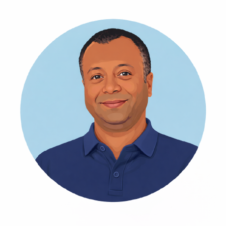
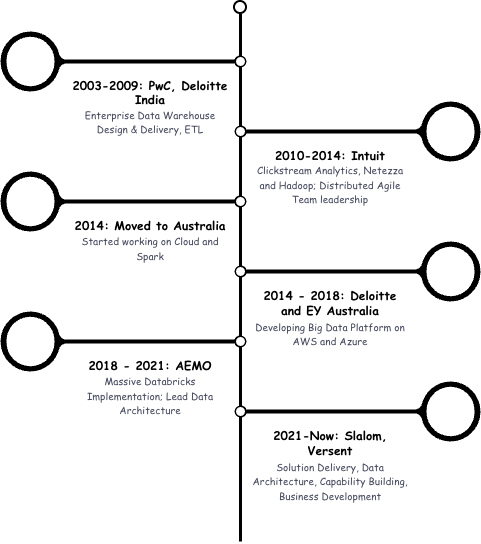
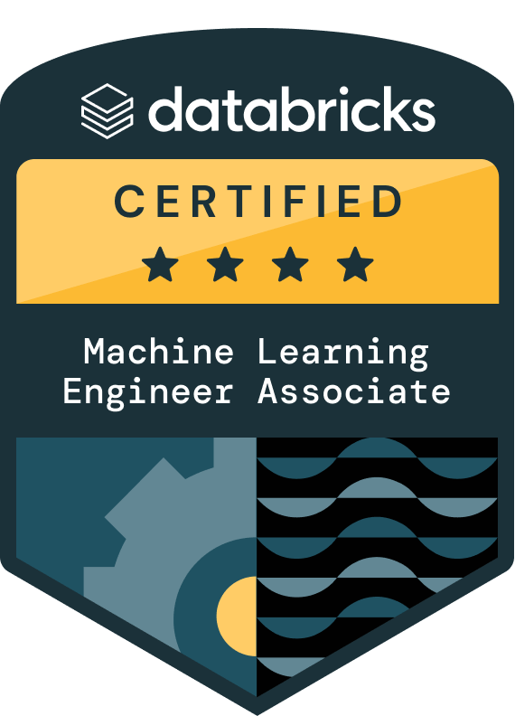
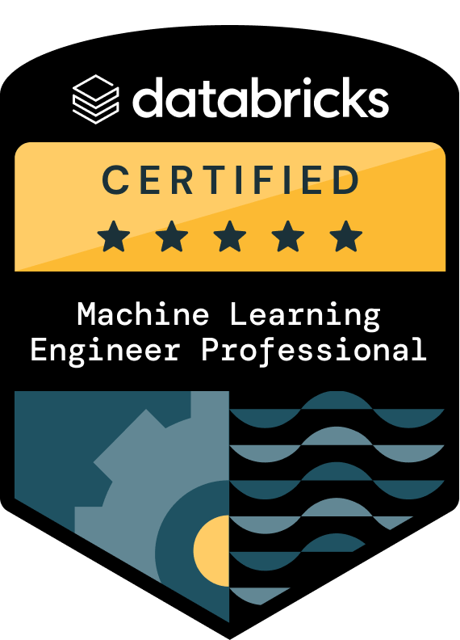
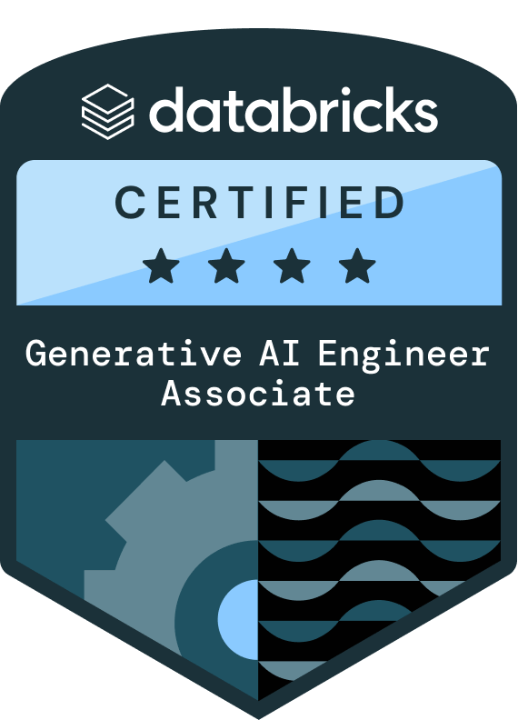
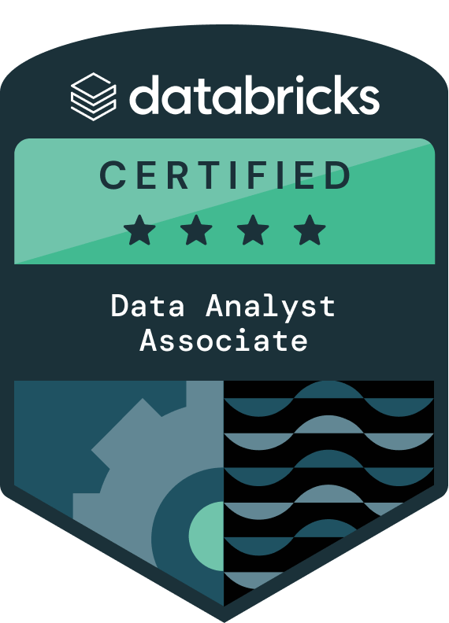
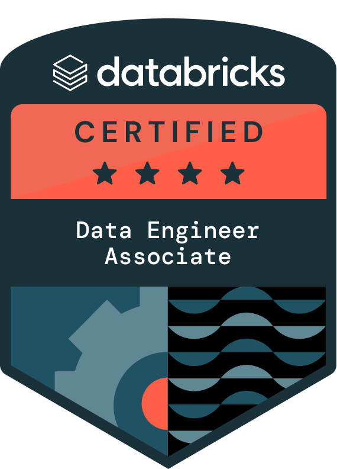
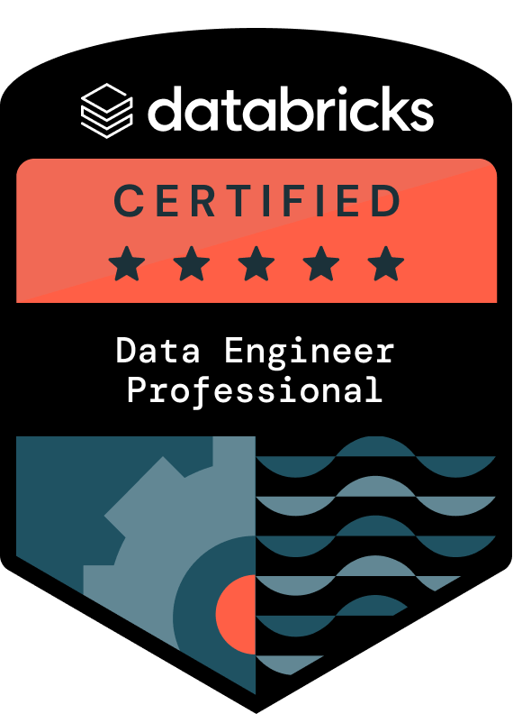

---
hide:
  - navigation
  - toc
---

# Ayan Guha

{ align=left width="300"}
    
{ align=right width="350"}

I am passionate about **Intelligent Data Platform** and **Trustworthy AI/ML Platform** that are reliable, scalable, observable and production-ready. As a senior Data and AI leader, I bring in **engineering rigor** and I own the **business outcomes** in the engagements I am involved in

---

## I love to do
- [Data and AI Platform](experience/#data-and-ai-platform): Data Platform Architecture, Platform Migrations, Data/AI/ML Engineering & Ops
- [Data and AI Advisory](experience/#data-and-ai-advisory): Data & AI Strategy and Roadmap, Data & AI Governance, AI Enablement
- [Intelligent Agentic Applications Development](experience/#intelligent-applications): Generative AI Applications, Traditional Machine Learning Solutions, Agentic Application

--- 

{ align=left width="100"}
{ align=left width="100"}
{ align=left width="100"}
{ align=left width="100"}
{ align=left width="100"}
{ align=left width="100"}
